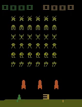

# Atari-Reinforcement-Learning
## Playing Space Invaders with Deep Q-Learning

Done By
* Shrish Shankar (2018B5A70707H)
* Keshav Kabra (2018AAPS0527H)
* Jayaram J  (2018B5A70796H)
* A Rohit Pradeep Kumar (2019A7PS0154H)

Implementation of [Playing Atari with Deep Reinforcement Learning](https://arxiv.org/pdf/1312.5602v1.pdf) and suggested improvements.

